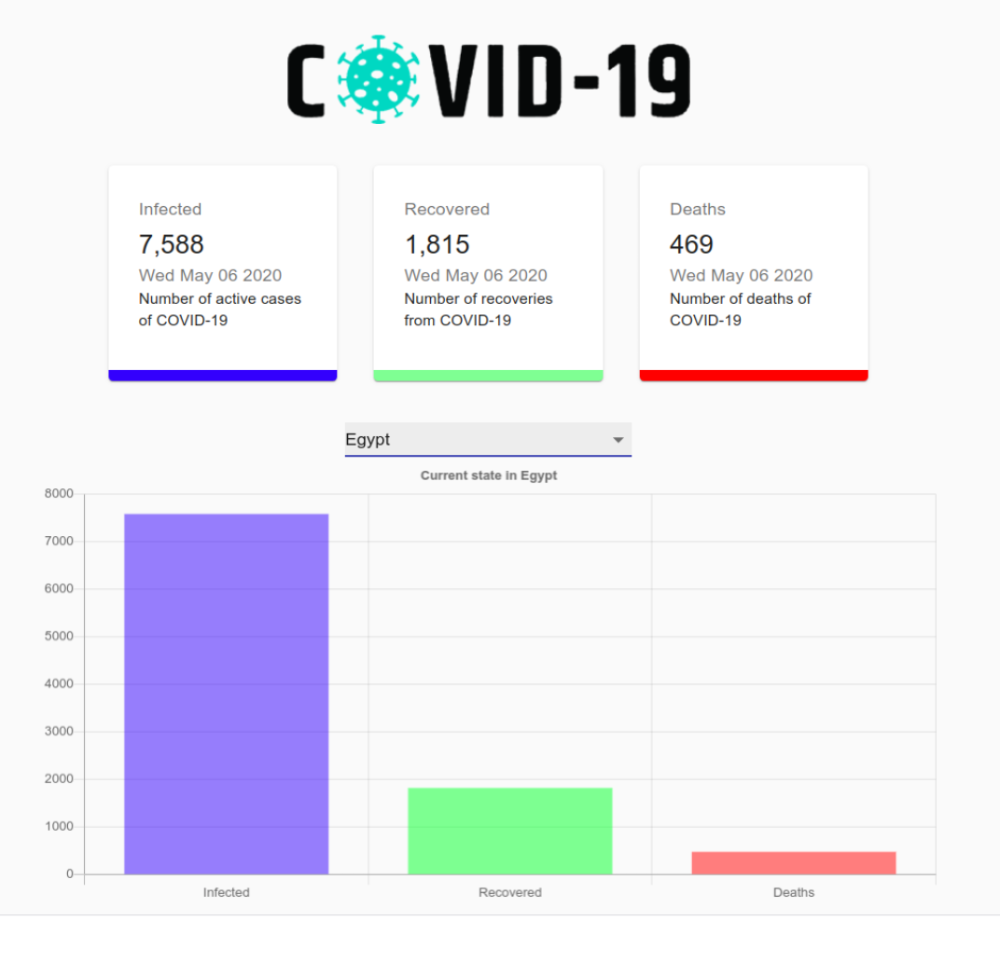

# CVOID-19 Tracker 

API used: https://covid19.mathdro.id/api

Clone this repo
`git clone`

Setup:
run
`npm i`
then
`npm start`
your React server will be hosted on localhost:3000

you can check the love site here : "https://bit.ly/2TLofVx"
